#  re-sln

Re-implementation of the paper titled ["Noise against noise: stochastic label noise helps combat inherent label noise"](https://openreview.net/forum?id=80FMcTSZ6J0) from ICLR 2021.

## Setup

Make a virtual env and install dependencies from the ```environment.yml``` file.

## Data

Data is at ```data/```.

### Download

Cifar10 and 1000 automatically downloaded with PyTorch.

Download animals data from [Animal-10N](https://dm.kaist.ac.kr/datasets/animal-10n/). After filling out a form, you get an email and get the ```raw image ver``` (called ```raw_image_ver.zip```) version, ```mkdir animal-10n``` and then put at data/animal-10n/raw_image_ver.zip. Then ```unzip raw_image_ver.zip``` and then ```unzip raw_image.zip``` that yields a folder structure data/animal-10n/training and data/animal-10n/testing with images. Then the animal trainign script takes care of extracting the annotations from the image file names (see data.py -> make_annotations_animals10n)

### Visualize

Visualize the CIFAR-10 dataset with symmetric or asymmetric noise, from the paper or with custom generated noise:
```
python viz.py cifar10 --noise_mode [sym, asym] [--custom_noise] --p 0.4 --seed 123
```
Visualize the CIFAR-10 dataset with dependent noise from the paper:
```
python viz.py cifar10 --noise_mode dependent --p 0.4 --seed 123
```
Visualize the CIFAR-10 dataset with openset noise, only custom generated openset noise is availabel:
```
python viz.py cifar10 --noise_mode openset --custom_noise --p 0.4 --seed 123
```
Note that if ```data/cifar10/label_noisy/openset0.4_custom.npy``` has not been yet generated, it has to be first. See Bugs.

Visualize the Animal-10N dataset which is naturally noisy:
```
python viz.py animal-10n --seed 123
```


## Run

Run the training as follows.

### CIFAR-10 and CIFAR-100

CIFAR-10, sym noise from paper, CE
```commandline
python train_cifar.py --dataset_name cifar10 --batch_size 128 --n_epochs 300 --lr 0.001 --noise_mode sym --p 0.4 --sigma 0 --lc_n_epoch -1 --seed 123
```
CIFAR-10, custom sym noise (from disk), CE
```commandline
python train_cifar.py --dataset_name cifar10 --batch_size 128 --n_epochs 300 --lr 0.001 --noise_mode sym --custom_noise --p 0.4 --sigma 0 --lc_n_epoch -1 --seed 123
```
CIFAR-10, newly generated custom sym noise, CE (if seed is set to non-zero, the noise will be the same across experiments)
```commandline
python train_cifar.py --dataset_name cifar10 --batch_size 128 --n_epochs 300 --lr 0.001 --noise_mode sym --custom_noise --make_new_custom_noise --p 0.4 --sigma 0 --lc_n_epoch -1 --seed 123
```
CIFAR-10, sym noise from paper, SLN
```commandline
python train_cifar.py --dataset_name cifar10 --batch_size 128 --n_epochs 300 --lr 0.001 --noise_mode sym --p 0.4 --sigma 1.0 --lc_n_epoch -1 --seed 123
```
CIFAR-10, sym noise from paper, SLN+MO
```commandline
python train_cifar.py --dataset_name cifar10 --batch_size 128 --n_epochs 300 --lr 0.001 --noise_mode sym --p 0.4 --sigma 1.0 --mo --lc_n_epoch -1 --seed 123
```
CIFAR-10, sym noise from paper, SLN+MO+LC
```commandline
python train_cifar.py --dataset_name cifar10 --batch_size 128 --n_epochs 300 --lr 0.001 --noise_mode sym --p 0.4 --sigma 1.0 --mo --lc_n_epoch 250 --seed 123
```
Similarly to CIFAR-10, for CIFAR-100:
CIFAR-100, sym noise from paper, SLN+MO+LC
```commandline
python train_cifar.py --dataset_name cifar100 --batch_size 128 --n_epochs 300 --lr 0.001 --noise_mode sym --p 0.4 --sigma 0.2 --mo --lc_n_epoch 250 --seed 123
```
etc.

Custom noise can be generated for all of CE, SLN, SLN+MO, and SLN+MO+LC. If seed is set to non-zero value across experiments, the generated custom noise will be the saem.

### Animal-10N

Real-world noise in labelling.

CE
```commandline
python train_real.py --dataset_name animal-10n --batch_size 128 --n_epochs 300 --lr 0.001 --sigma 0 --lc_n_epoch -1 --seed 123
```

SLN
```commandline
python train_real.py --dataset_name animal-10n --batch_size 128 --n_epochs 300 --lr 0.001 --sigma 0.5 --lc_n_epoch -1 --seed 123
```

SLN+MO
```commandline
python train_real.py --dataset_name animal-10n --batch_size 128 --n_epochs 300 --lr 0.001 --sigma 0.5 --mo --lc_n_epoch -1 --seed 123
```
SLN+MO+LC
```commandline
python train_real.py --dataset_name animal-10n --batch_size 128 --n_epochs 300 --lr 0.001 --sigma 0.5 --mo --lc_n_epoch 250 --seed 123
```

### Configs

All experiments' models and training setup config parameters are saved at configs/ in YAML format.

### Plotting (Only CIFAR-10 and CIFAR-100)

All plots are in ```assets/```.

Plot prediction probabilities for noisy and clear samples.
```commandline
python plot.py --exp_id "exp_2021-12-08 11:28:45.265396" --plot_type pred_probs
```

Plot sample dissection from paper:
```commandline
python plot.py --exp_id "exp_2021-12-08 11:28:45.265396" --plot_type sample_dissect
```

## Hyperparameter Search of Sigma

The best sigma is searched for in the grid 0.1, 0.2, 0.5, and 1.0, as discussed in the paper. Note that the tune.py script needs 4 CPUs and 2 GPUs to run. If needed, the script can be changed to accomodate for less computational resources. The hyperparameter search uses Ray Tune, a distributed machine learning framework.

Example: Tune an SLN model on CIFAR-10 with the noise provided b the authors, with a validation size of 10 % (5000 noisy samples, as discussed in the paper). In the paper, only SLN models are tuned since MO and LC can hide the effect of sigma potentially.  
```
python tune.py --dataset_name cifar10 --batch_size 128 --n_epochs 300 --lr 0.001 --noise_mode sym --p 0.4 --lc_n_epoch -1 --val_size 0.1 --seed 123
```

## Example Inherent Noise in Labels

Visualizing uniformly randomly drawn samples from the noisy datasets.

### CIFAR-10

CIFAR-10, asymmetric noise with probability 0.4, custom generated:

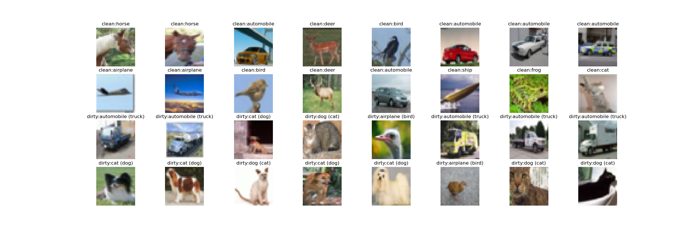

CIFAR-10, asymmetric noise with probability 0.4, provided with the paper:

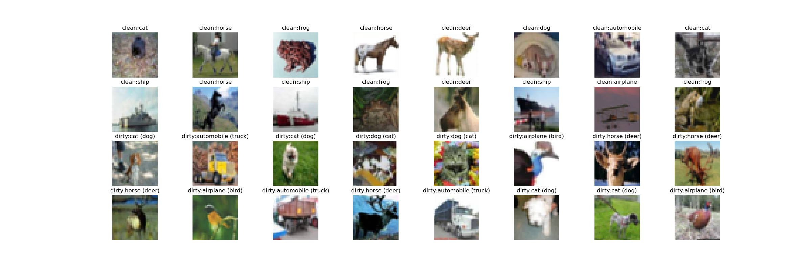

CIFAR-10, dependent noise with probability 0.4, provided with the paper:

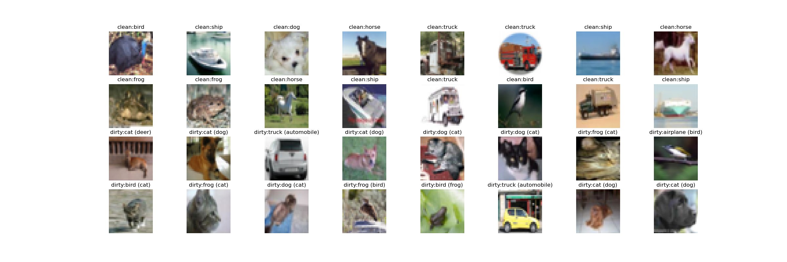

CIFAR-10, openset noise with probability 0.4, custom generated:

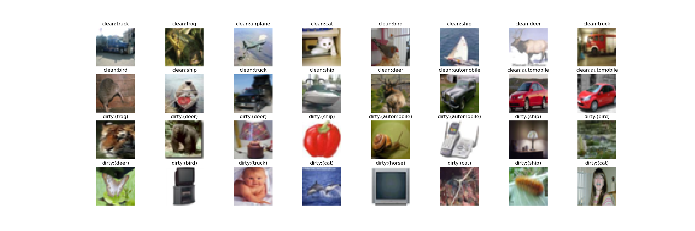

CIFAR-10, symmetric noise with probability 0.4, custom generated:

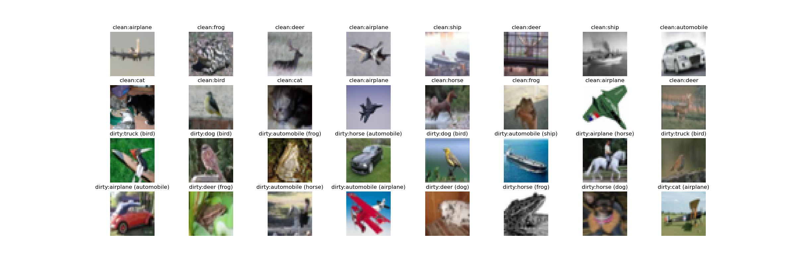

CIFAR-10, symmetric noise with probability 0.4, provided with the paper:

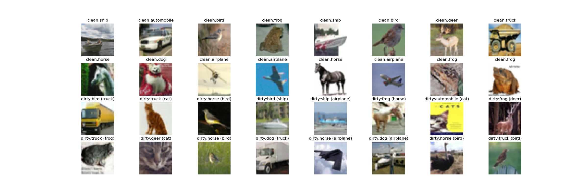

### CIFAR-100

CIFAR-100, asymmetric noise with probability 0.4, custom generated:

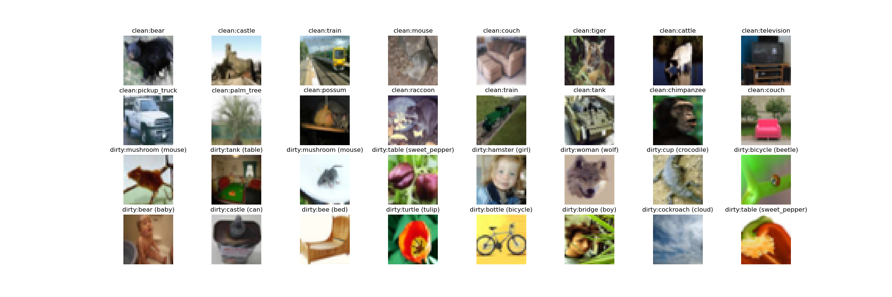

CIFAR-100, asymmetric noise with probability 0.4, provided with the paper:

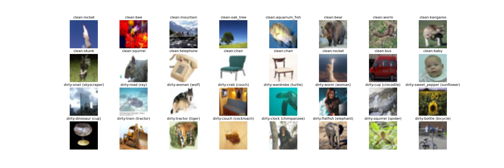

CIFAR-100, dependent noise with probability 0.4, provided with the paper:

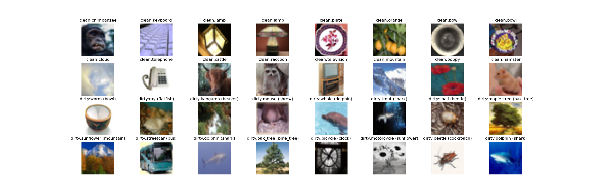

CIFAR-100, symmetric noise with probability 0.4, custom generated:

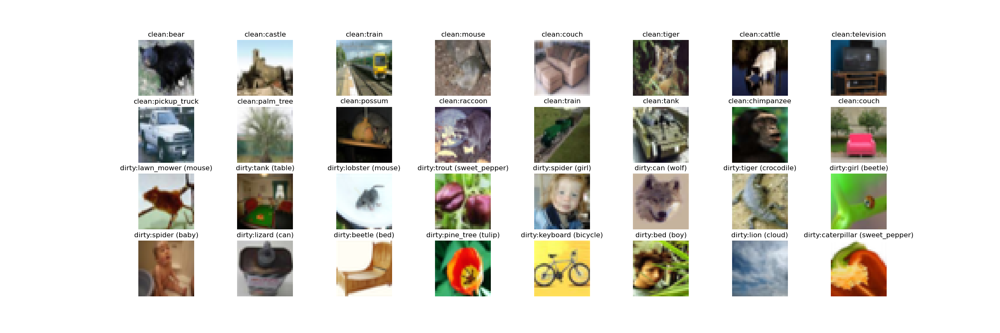

CIFAR-100, symmetric noise with probability 0.4, provided with the paper:

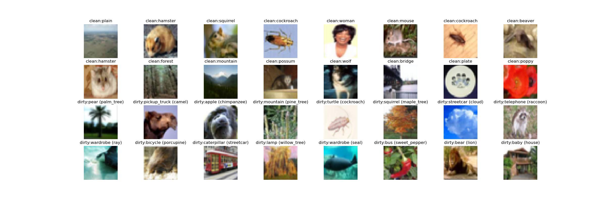

### Animal-10N

Samples from the naturally noisy Animal-10N dataset.

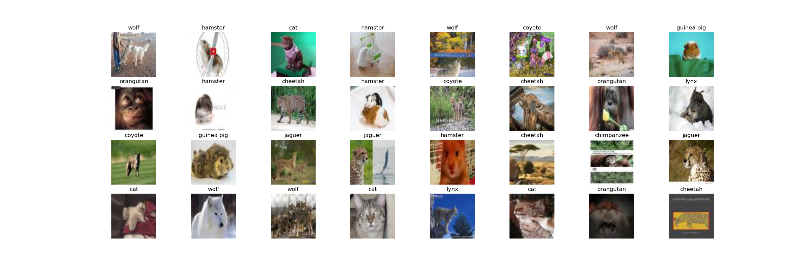

## Experiments and Results

### General Performance on CIFAR-10

Experiments with CIFAR-10 (p=0.4): sym (paper, mine), asym (paper, mine), dependent (paper), openset (paper, mine). Available models: CE, SLN, SLN+MO, SLN+MO+LC. 24 experiments.

| model / noise | sym                            |                                | asym                           |                                | dependent                      |        | openset |                                |
|---------------|--------------------------------|--------------------------------|--------------------------------|--------------------------------|--------------------------------|--------|---------|--------------------------------|
|               | paper                          | custom                         | paper                          | custom                         | paper                          | custom | paper   | custom                         |
| CE            | exp_2021-11-25 13:17:26.851200 | exp_2021-11-25 20:30:28.794160 | exp_2021-11-26 09:21:19.524188 | exp_2021-11-26 14:03:18.975684 | exp_2021-11-26 20:14:40.983299 | x      | x       | exp_2021-11-27 13:35:23.026659 |
| SLN           | exp_2021-11-25 15:38:09.361059 | exp_2021-11-25 20:31:37.546765 | exp_2021-11-26 11:41:56.758060 | exp_2021-11-26 16:11:00.844488 | exp_2021-11-27 11:07:55.847340 | x      | x       | exp_2021-11-27 13:44:37.885816 |
| SLN+MO        | exp_2021-11-25 16:46:29.066838 | exp_2021-11-26 09:18:14.291265 | exp_2021-11-26 11:44:27.727904 | exp_2021-11-26 16:14:06.628600 | exp_2021-11-27 11:11:07.020347 | x      | x       | exp_2021-11-27 13:46:43.777573 |
| SLN+MO+LC     | exp_2021-11-26 11:18:36.051172 | exp_2021-11-26 13:51:03.590616 | exp_2021-11-26 13:57:45.567433 | exp_2021-11-26 16:16:06.031597 | exp_2021-11-27 11:14:24.120092 | x      | x       | exp_2021-11-28 16:34:38.935269 |

Results from the above experiments:

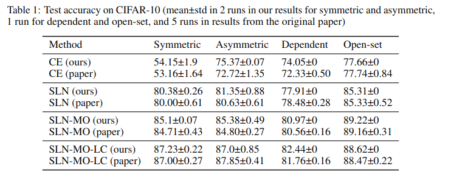

The average of 2 runs is considered, where applicable.

### General Performance on CIFAR-100

Experiments with CIFAR-100 (p=0.4): sym (paper, mine), asym (paper, mine), dependent (paper), no openset. Available models: CE, SLN, SLN+MO, SLN+MO+LC. 20 experiments.

| model / noise | sym                            |                                | asym                           |                                | dependent                      |        | openset |        |
|---------------|--------------------------------|--------------------------------|--------------------------------|--------------------------------|--------------------------------|--------|---------|--------|
|               | paper                          | custom                         | paper                          | custom                         | paper                          | custom | paper   | custom |
| CE            | exp_2021-11-29 13:02:42.947124 | exp_2021-11-29 15:14:24.277293 | exp_2021-12-02 17:15:05.141925 | exp_2021-12-02 20:50:30.272408 | exp_2021-12-03 12:09:50.374569 | x      | x       | x      |
| SLN           | exp_2021-11-29 13:12:28.474547 | exp_2021-11-29 15:15:36.143703 | exp_2021-12-02 17:34:08.440889 | exp_2021-12-02 20:55:53.387841 | exp_2021-12-03 14:37:51.783033 | x      | x       | x      |
| SLN+MO        | exp_2021-11-29 13:16:11.590910 | exp_2021-11-29 22:15:08.652843 | exp_2021-12-02 17:39:34.952358 | exp_2021-12-03 11:53:37.290785 | exp_2021-12-03 14:43:27.237441 | x      | x       | x      |
| SLN+MO+LC     | exp_2021-11-29 22:04:19.910053 | exp_2021-11-29 22:26:18.532929 | exp_2021-12-02 20:43:32.204172 | exp_2021-12-03 12:01:04.662910 | exp_2021-12-03 14:51:11.441549 | x      | x       | x      |

Results from the above experiments:

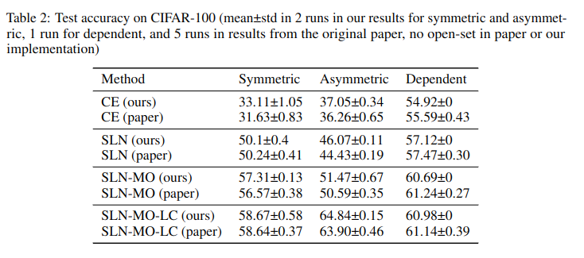

The average of 2 runs is considered, where applicable.

Average training time, in the case of each experiment was around 100 minutes with a single NVIDIA V100 GPU. 

### Hyperparameter Search for the optimal sigma on CIFAR-10

Symmetric noise, noise from paper: ```hp_2021-12-03_13-18-02``` (sigma=[0.1, 0.2, 0.5, 1.0])

Symmetric noise, custom noise: ```hp_2021-12-04_17-04-54``` (sigma=[0.1, 0.2, 0.5, 1.0])

Asymmetric noise, noise from paper: ```hp_2021-12-05_10-55-09``` (sigma=[0.1, 0.2, 0.5, 1.0])

Asymmetric noise, custom noise, ```hp_2021-12-05_14-46-12``` (sigma=[0.1, 0.2, 0.5, 1.0])

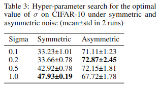

### Ablation Study of the Effects of Sigma on CIFAR-10

Only on CIFAR-10, and only with symmetric noise. 18 experiments.

| sigma     | paper                          | custom                         |
|-----------|--------------------------------|--------------------------------|
| 0 (ce)    | exp_2021-11-25 13:17:26.851200 | exp_2021-11-25 20:30:28.794160 |
| 0.2       | exp_2021-12-04 18:44:30.809125 | exp_2021-12-04 18:45:29.413332 |
| 0.4       | exp_2021-12-04 20:16:53.822991 | exp_2021-12-04 20:17:35.698730 |
| 0.6       | exp_2021-12-05 10:32:08.543830 | exp_2021-12-05 10:33:02.145316 |
| 0.8       | exp_2021-12-05 14:47:21.250193 | exp_2021-12-05 14:47:51.111383 |
| 1.0 (sln) | exp_2021-11-25 15:38:09.361059 | exp_2021-11-25 20:31:37.546765 |
| 1.2       | exp_2021-12-05 17:40:34.580201 | exp_2021-12-05 17:41:13.978731 |
| 1.4       | exp_2021-12-06 21:07:47.205424 | exp_2021-12-06 21:07:59.931017 |
| 1.6       | exp_2021-12-07 20:08:48.682079 | exp_2021-12-07 20:09:03.085870 |
| 1.8       | exp_2021-12-08 11:28:45.265396 | exp_2021-12-08 11:29:11.334586 |
| 2.0       | exp_2021-12-08 13:04:50.380869 | exp_2021-12-08 13:01:27.453031 |

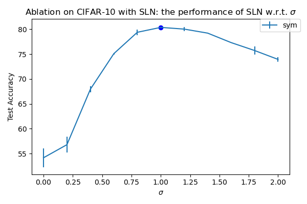

### General Performance on Animals-10N (Naturally Noisy Dataset)

6 experiments. sigma = 0.5 in all experiments (except CE).

| model / run | run1                           | run2                           |   |
|-------------|--------------------------------|--------------------------------|---|
| CE          | exp_2021-12-08 11:38:16.477097 | exp_2021-12-08 20:23:04.646474 |   |
| SLN         | exp_2021-12-08 13:06:15.220761 | exp_2021-12-08 18:29:16.424429 |   |
| SLN+MO      | exp_2021-12-08 14:43:36.523374 | exp_2021-12-08 18:29:27.093767 |   |
| SLN+MO+LC   | exp_2021-12-07 21:55:00.730335 | exp_2021-12-08 18:35:55.422639 |   |


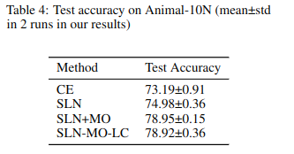

## Logs

All logs for Tensorboard are in ```runs/```.

View the logs locally with:
```
tensorboard --logdir runs
```

or on [Tensorboard.dev](https://pytorch.org/tutorials/recipes/recipes/tensorboard_with_pytorch.html#share-tensorboard-dashboards)):
```
tensorboard dev upload --logdir runs --name "re-sln results" --description "By Mark"
```


## Bugs

For instance for
```
python viz.py cifar10 --noise_mode openset --custom_noise --p 0.4 --seed 123
```
or
```
python train_cifar.py --dataset_name cifar10 --batch_size 128 --n_epochs 1 --lr 0.001 --noise_mode openset --custom_noise --p 0.4 --sigma 0 --lc_n_epoch -1 --seed 123
```

FileNotFoundError: [Errno 2] No such file or directory: '/home/jupyter/final/re-sln/data/cifar10/label_noisy/openset0.4_custom.npy'

generate openset first by  a quick 1 epoch training on cifar10 (since opsent is only for cifar10)
```
python train_cifar.py --dataset_name cifar10 --batch_size 128 --n_epochs 1 --lr 0.001 --noise_mode openset --custom_noise --make_new_custom_noise --p 0.4 --sigma 0 --lc_n_epoch -1 --seed 123
```
